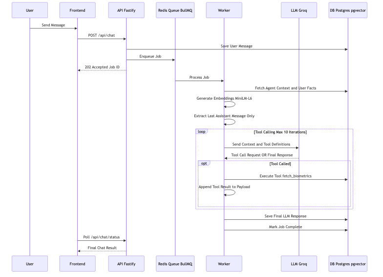
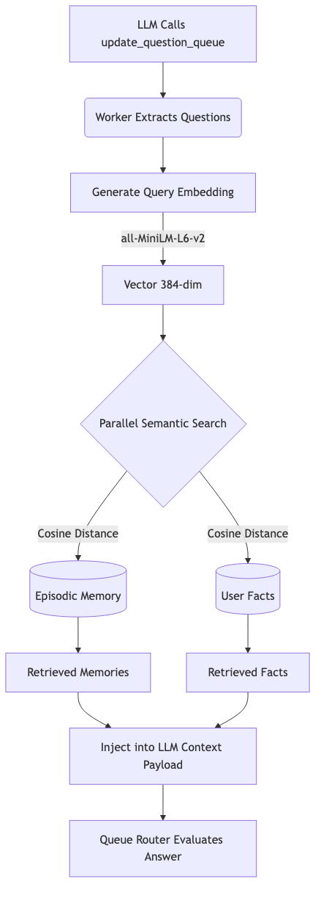
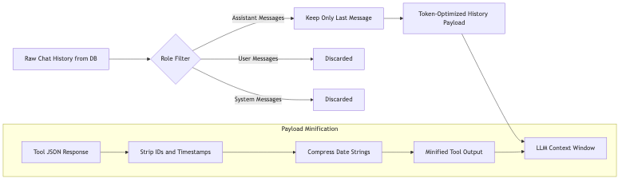

# HoliAI - Holistic Coaching AI App (SaaS)

<p align="center">
  
</p>

Welcome to **HoliAI**. This repository contains a fully decoupled, multi-tenant Bring-Your-Own-Key (BYOK) **Holistic Coaching AI Application** and SaaS platform powered by an **Autonomous Self-Evolving LLM Persona**.

## Architecture & Features
1. **Autonomous Tool-Calling Architecture**: The AI coach dynamically fetches its own context using a robust Function Calling (Tool Calling) loop. It autonomously queries the database for your plans and crons *only* when needed, completely eliminating token bloat and context pollution.
2. **Self-Evolving AI**: The AI dynamically learns your goals based on your conversations. It autonomously mutates its own core system prompt in the database to become a hyper-specialized expert tailored to your exact needs.
3. **BYOK Ecosystem**: Instead of a centralized database storing everyone's private health data, users provide their own **Groq** and **Device Provider** keys directly in the Frontend Settings tab.
4. **Dynamic Coach Personality**: Customize the strictness and behavior of your AI coach by choosing predefined personas (Strict, Empathetic, Socratic) or injecting your own custom coaching prompt directly into the system parameters.
5. **Dynamic Model Selection**: Connects directly to Groq to offer a real-time selection of all available open-source models (Llama 3.3, Qwen, DeepSeek, etc.).
6. **Deep Semantic Memory (Local RAG)**: Runs an internal, on-device `all-MiniLM-L6-v2` embedding model (via ONNX runtime) to instantly convert chat history into mathematical vectors. Powered by `pgvector` utilizing cosine distance filtering (`<=>`), the AI mathematically searches your past conversations to retrieve obscure facts from months ago, keeping costs at $0. A fully configurable **RAG Relevance Threshold** (default: `0.5`) is exposed directly in the UI Settings tab to prevent retrieving unrelated data, enforcing strict semantic purity.
7. **Contextual Fact Memory**: The backend autonomously extracts foundational metrics (age, weight, goals) during conversation and stores them permanently with timestamps.
8. **Local Postgres & Redis**: A fully bundled local vector database (`pgvector`) and Redis queue means you do not need to connect external cloud databases during local development.
9. **Full Localization (EN/CS)**: Deep LLM system constraints force the AI to reason and generate plans natively in your preferred language, synchronized automatically with a dynamic frontend UI localization dictionary.
10. **Autonomous Background Routines**: The AI autonomously formulates and schedules cron jobs and alarms inside a dedicated "Routines" tab to track your progress even when you are away.
11. **Hybrid Context Engineering**: Extracts and pre-loads permanent user facts dynamically into the LLM system prompt, eliminating costly recursive context-fetching tool loops. It combines Recency retrieval with Semantic Fact RAG and uses deep recursive minification and **On-Demand Category Fetching** to massively shrink redundant payload metadata.
12. **Full-Stack Caching Architecture**: Features a backend Redis write-through cache to eliminate database bottlenecks, coupled with a frontend Stale-While-Revalidate (SWR) mechanism using `localStorage` for an instant, zero-latency PWA experience.
13. **Resilient AI Loop & State Restoration**: Built a robust LLM retry orchestration loop handling deterministic JSON parsing fallbacks, regex-powered tool hallucination recovery for model schema rejections, and transparent exponential backoff on 5xx network errors. Critically, it features **Agent State Restoration** for 429/TPM rate limits: when a limit is hit, the worker parks the job in BullMQ with the precise Groq wait time plus a 1-minute safety buffer, fully preserving the conversation and intermediate tool calls, then perfectly resumes without duplicate LLM queries when the quota returns. Ensures absolute data integrity by enforcing thread-safe, sequential processing for all internal concurrent model generations.
14. **Exact AI Audit Log**: Tracks and persistently saves every intermediate step the AI takes (tool calls, memory searches) along with robust rate limit handling directly into the permanent episodic memory database. Uses standard database inserts to preserve a transparent, sequentially accurate log of all active polling and network retry statuses, ensuring complete visibility without sugarcoating errors.
15. **LLM Developer Debug View**: Features a powerful built-in "Debug" tab that automatically captures and displays raw LLM request/response payloads, latency, and detailed token usage breakdowns without requiring external telemetry setups. This can be instantly toggled on and off via the "Debug Mode" checkbox in Settings, completely bypassing trace collection when disabled to reduce backend overhead.
16. **Question Queue Orchestration & RAG Purity**: Context is seamlessly injected using a dedicated Question Queue tool loop that automatically retrieves semantic facts and episodic memories related to pending conversation queries, eliminating token bloat from blind fact-finding. The queue enforces **RAG Semantic Purity** (default relevance threshold `0.5`) to retrieve only strictly relevant data without raw chat history. The Queue Router natively inspects incoming questions, instantly skipping obsolete ones and dequeuing the next valid question to immediately fetch RAG context, eliminating the need to micromanage the queue.
17. **Strictly Modular Backend Layer**: The backend features a completely decoupled PostgreSQL database schema engine (broken down logically by episodic memory, facts, crons, biometrics) and a single-responsibility worker layer, making the codebase highly maintainable and SLA-compliant.

## 📊 System Flow Diagrams

The following diagrams illustrate the core background processes of HoliAI, specifically detailing how the backend handles LLM context, tool dispatching, and token optimization.

### 1. Complete Request Lifecycle
**When is this used?** This flow is triggered every time you send a message in the chat interface.
**What is it showing?** It maps the journey of your message from the frontend, into the asynchronous BullMQ job queue, and through the multi-turn agent tool loop. The worker dynamically fetches context, executes tools requested by the LLM (like reading biometrics or creating plans), and saves the final response only once the LLM stops requesting tools.



### 2. RAG Pipeline (Episodic Memory & User Facts)
**When is this used?** This flow is triggered dynamically in the middle of a conversation if the LLM calls the `update_question_queue` tool.
**What is it showing?** It shows how the backend uses a local, open-source ONNX embedding model to convert the pending questions into a 384-dimensional vector. It then performs a high-speed cosine similarity search (`<=>`) against your historical chat memories and permanent facts, retrieving only the mathematically relevant answers to inject into the prompt.



### 3. Token Optimization Architecture
**When is this used?** This optimization happens silently during the `buildMessages()` step right before every single LLM API request.
**What is it showing?** It demonstrates our aggressive strategy to keep API costs near zero. Instead of blindly passing the entire chat history back to the LLM (which causes exponential token bloat), the worker filters the database history, discards all past user messages and system messages, and attaches **only the single most recent assistant response** alongside the new user prompt. Auxiliary tool payloads are also stripped of redundant DB timestamps and UUIDs.



---


## 🗂️ Repository Structure

This monorepo is divided into two decoupled, fully independent sub-repositories:

- **[Frontend (HoliAI-fe)](./holi-ai-fe/README.md)**: A Next.js PWA featuring native iOS-style UI aesthetics, dynamic Groq model selectors, smart dashboard merging, UI-level routine (cron) management, and secure BYOK ecosystem management entirely in the browser. It natively supports Capacitor for iOS/Android compilation.
- **[Backend (HoliAI-be)](./holi-ai-be/README.md)**: A robust Node.js Fastify + BullMQ backend worker. It securely routes BYOK API keys, dynamically interprets LLM schemas, runs local on-device RAG semantic search via `pgvector`, and handles the autonomous execution of your background alarms/crons.

---

## 🚀 Deployment Guide

This repository is pre-configured with Enterprise-grade deployment pipelines. You can deploy it "out of the box" in minutes.

### 1. Web Deployment (Vercel + Render)
This is the recommended architecture for the highest performance.

*   **Frontend (Vercel)**:
    1. Push this repository to GitHub.
    2. Go to [Vercel](https://vercel.com/), click "Add New Project", and import your repository.
    3. Make sure the "Framework Preset" is set to `Next.js` and the Root Directory is set to `holi-ai-fe`.
    4. Vercel will automatically read the `vercel.json` and deploy your blazing-fast edge-cached web app!

*   **Backend & Queue (Render)**:
    1. Go to [Render](https://render.com/), click "New", and select "Blueprint".
    2. Connect your GitHub repository.
    3. Render will automatically read the `render.yaml` file in the root directory.
    4. It will provision a Managed Redis Database and a Node.js Fastify Backend server pre-linked together.

*Once both are deployed, open your Vercel URL, go to Settings, and paste your BYOK API Keys. You're live!*

---

### 2. Native Mobile App Deployment (Android & iOS)
If you want to package the app into a native smartphone application, the repository includes a fully interactive build wizard to handle the frontend static export and Capacitor synchronization.

**Locating your Render URL:**
1. Go to your [Render Dashboard](https://dashboard.render.com/).
2. Click on the "Web Service" that was created for your backend.
3. In the top-left corner under the service name, copy the URL (it will look like `https://your-app-name.onrender.com`).

**Building the App:**
1. Open PowerShell in the root directory.
2. Run the mobile build script:
   ```powershell
   .\build-mobile.ps1
   ```
3. The wizard will prompt you for your live backend URL. Paste the Render URL you copied in the previous step. It will securely inject it into `.env.production` and compile the assets.
4. Once completed, it will automatically prompt you to launch Android Studio or Xcode to instantly compile your `.apk` or iOS app!

---

### 3. Local Docker Testing (Interactive Wizard)
If you want to test the entire isolated stack (Frontend, Backend, Postgres, Redis) on your local machine, use the bundled interactive launcher.

1. Ensure Docker Desktop is running.
2. Open PowerShell in the root directory and run the launcher script:
   ```powershell
   .\start-local.ps1
   ```
3. The wizard will optionally configure Ngrok for you (if you want to test device webhooks locally) and securely write your secrets.
4. It will dynamically boot the entire cluster. Access the app at `http://localhost:3000`.

### 🛑 Safely Stopping the Local Cluster
To safely bring down the entire cluster, remove orphaned profile containers (like Ngrok), and clean up the networks, simply run:
```powershell
.\stop-local.ps1
```

---

## 🧪 Automated Testing
The repository features fully isolated testing suites on both ends with a strict >80% branch coverage requirement to pass CI/CD builds:
- **Backend (Jest)**: Fully mocks out PostgreSQL, queues, and external dependencies for deterministic, zero-cost, offline-ready integration and unit tests.
- **Frontend (Vitest)**: Utilizes Vitest, jsdom, and React Testing Library to test all deeply-abstracted custom hooks (caching, chat, device logs) and completely mocks out network (fetch), localStorage, and Capacitor primitives. No live services are permitted during testing.

To run the test suites:
1. Navigate to the backend: `cd holi-ai-be` and run `npm test`
2. Navigate to the frontend: `cd holi-ai-fe` and run `npm test`


