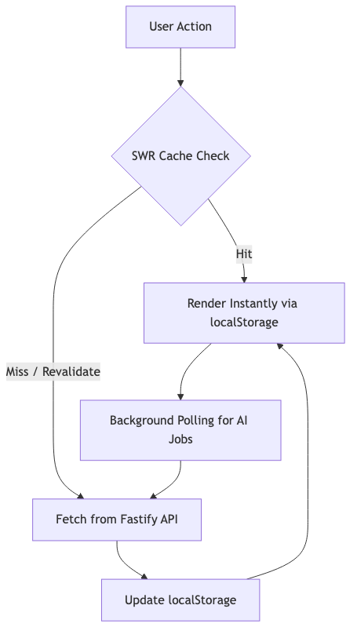

# HoliAI - Holistic Coaching AI Frontend

This is the Next.js frontend for **HoliAI**, the Holistic Coaching AI App. It features native iOS-style UI aesthetics, dynamic Groq model selectors, and secure BYOK ecosystem management entirely in the browser.

### Key Frontend Capabilities
- **Decoupled 4-Tab Navigation**: Clean architectural separation between your telemetry Dashboard (Plan), Active Routines (Cron jobs), the AI Chat interface (Coach), and BYOK configuration (Settings).
- **Dynamic Localization (EN/CS)**: Full user-interface dictionary swapping linked to browser `localStorage` and synchronized with backend API LLM constraints.
- **Smart Payload Merging**: The frontend dynamically aggregates historical AI telemetry modules without overwriting active cards, creating an un-cluttered persistent dashboard. Action Module cards natively parse and render specific category structures (e.g., Fitness, Nutrition) for highly isolated, token-efficient updates.
- **Dynamic Coach Personality UI**: Easily select or customize the AI Coach's strictness and conversational behavior using built-in modals.
- **Cascaded Alarms Management**: Safely tie generated background routines directly to active modules, with clean, localized, two-step deletion confirmation UI modals.
- **SWR Zero-Latency Caching**: Utilizes a completely abstracted Stale-While-Revalidate caching architecture against `localStorage` allowing the PWA to load past chats and health metrics instantly on frame-1.
- **LLM Debugging Tab**: An advanced developer view integrated directly into the frontend that exposes complete LLM reasoning traces, real-time input/output payloads, and token consumption to rapidly iterate on prompt engineering. Automatically captures and explicitly highlights network errors, API glitches, and rate limit delays in distinct RED error traces to instantly diagnose failing prompts.
- **Comprehensive Vitest Suite**: Deeply abstracted custom hooks (`useChat`, `useNotifications`, `useCrons`, `useDebug`, etc.) are fully covered by a highly-mocked Vitest and React Testing Library environment ensuring flawless state and UI logic (including handling of backend `loadMore` rejections, denied device permissions, and network failures), with strict >80% branch coverage thresholds.

**Please refer to the root [README.md](../README.md) in the parent directory for complete SaaS architecture details, BYOK key management, and comprehensive deployment instructions (Vercel, Render, Docker, and Capacitor Mobile App).**

---

### 📊 Frontend Architecture Diagram

---

### 📱 Native Mobile App Deployment (Android & iOS)

This frontend is pre-configured with **Capacitor** to easily compile into native smartphone applications.

1. Install frontend dependencies: `npm install`
2. Run the mobile export script: `npm run build:mobile`
   *(This triggers a static HTML export via Next.js and syncs it directly into the native Capacitor iOS/Android folders).*
3. Open your native IDE to compile the APK/App:
   *   **Android**: `npx cap open android` (Requires Android Studio)
   *   **iOS**: `npx cap open ios` (Requires Xcode)
